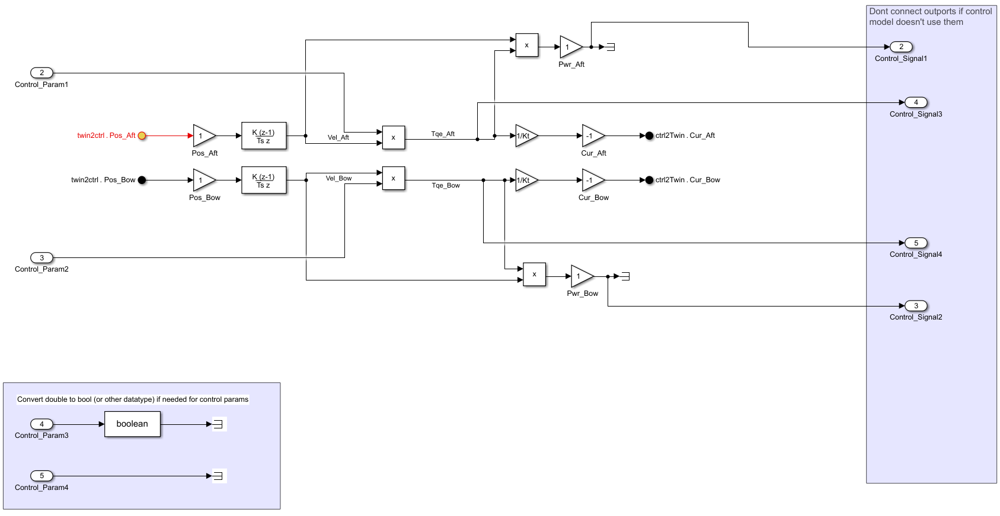
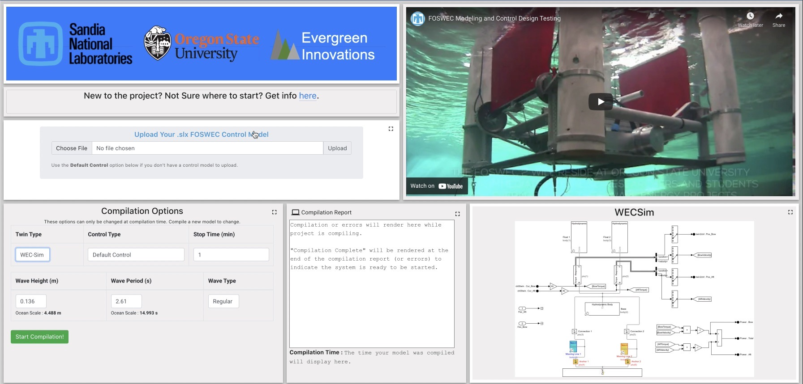
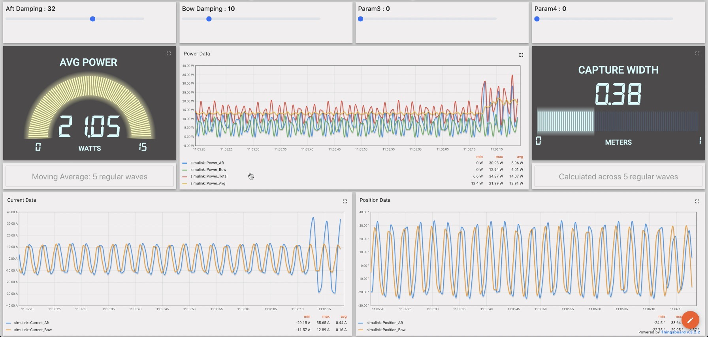
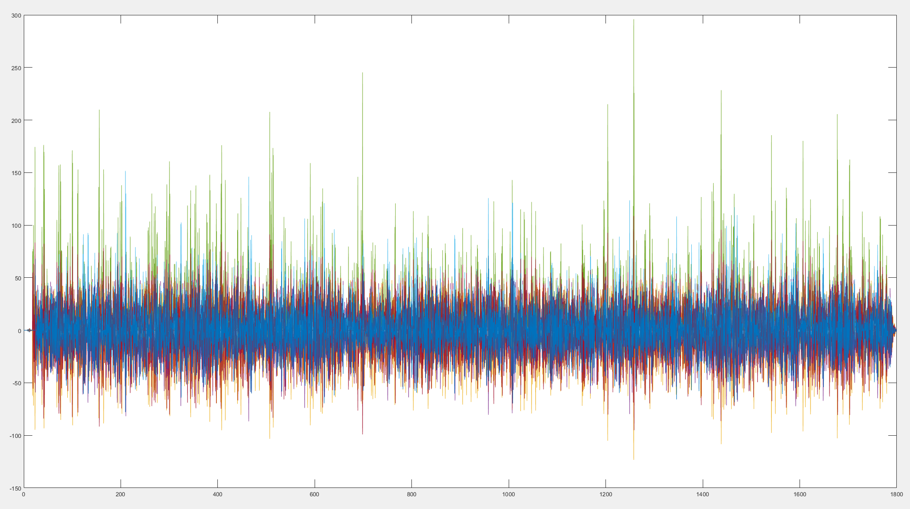

<!-- ## Mask Basin Workshop & FOSTWIN Digital Twin omit in toc -->

**Participate in our FOSTWIN control competition for the glory and travel support for a workshop at the MASK Basin Workshop in Bethesda, MD.**

## Competition <!-- omit in toc -->

Develop a controller for a digital twin of the [FOSWEC](https://energy.sandia.gov/foswec-testing-helps-validate-open-source-modeling-code/) device.
The goal of this controller will be to generate the ***most electrical power***.
The top ***N*** electrical power producing controllers will be selected based off data produced and gathered during the simulation and the developer will be awarded the opportunity to participate in, and have their travel expenses reimbursed for attending the [MASK Basin](https://www.defense.gov/Multimedia/Photos/igphoto/2001207018/#:~:text=The%20Navy's%20Indoor%20Ocean%20%2D%2D,Carderock%20Division%2C%20located%20in%20Maryland.) Workshop in **September 2023**.
The competition will focus on the FOSWEC v2 device tested at the [OSU O.H. Hinsdale Wave Research Laboratory](https://engineering.oregonstate.edu/facilities/wave-lab), and controllers will be run against a ***digital twin*** model that runs in real time.

### Backgroud material

 - [FOSWEC v2 YouTube video](https://youtu.be/OUxbaEC2K6Y)
 - [FOSWEC v2 testing report](https://doi.org/10.2172/1717884)
 - [FOSWEC v2 journal paper](https://doi.org/10.1016/j.energy.2021.122485)

### Competition Timeline

| Event | Date |
|---|---|
| Competition Kick Off | August 31, 2022 |
| [Motion and Vibration Control (MoViC 2022)](https://ifacms-movic2022.seas.ucla.edu/home/) info session | September 7-9, 2022 |
| [OREC/UMERC+METS](https://pacificoceanenergy.org/orec/) info session | September 13-15, 2022 |
| In-person PMEC workshop at Oregon State | Winter 2022/2023 |
| Final Submissions | Late Spring 2023 (e.g., May 2023) |
| MASK Basin workshop | September 2023 |

### Competition Award

While everyone who participates in this competition will have the opportunity to advance their WEC modeling and controller skills through the events leading to the [competition submission date](#competition-timeline), the developers of the top ***N*** controllers will be awarded travel expense reimbursement to attend the [**MASK Basin workshop**](https://www.defense.gov/Multimedia/Photos/igphoto/2001207018/#:~:text=The%20Navy's%20Indoor%20Ocean%20%2D%2D,Carderock%20Division%2C%20located%20in%20Maryland.) in **September 2023**.
Through the final workshop, and the events leading up to the competition submission date, participants and awardees will meet industry leaders and WEC experts from Sandia, OSU, and the NAVY (just to name a few) to grow their wave energy network.

At the workshop, the winning developers will participate in a large scale tank testing campaign of the Sandia WaveBot.
In doing so, the awardees will learn in-depth details about tank testing of WEC devices to validate System Identification modeling techniques.
In addition to the measurements collected and the numerical methods used in the system identification validation, the awardees will gain hands-on experience with the tools, sensors, and methodology used to measure forces exerted on and throughout the WEC.  

<!-- Make a table for aligning images -->

| - | - |
|---|---|
|  |  |

##### Sandia WaveBot <!-- omit in toc -->

<iframe width="560" height="315" src="https://www.youtube.com/embed/c4npWk_-Pjk" title="YouTube video player" style="width:100%;" frameborder="0" allow="accelerometer; autoplay; clipboard-write; encrypted-media; gyroscope; picture-in-picture" allowfullscreen></iframe>

### Goals of Competition <!-- omit in toc -->

1. Connect motivated WEC developers with industry leaders and researchers
2. Build experience with developing real-time control software for WEC Devices
3. Extend on content from the 2019 PMEC workshop (video below of PMEC Workshop) and learn about FOSWEC devices
4. Acquire knowledge about WEC modeling in working with the [FOSTWIN](https://github.com/PMEC-OSU/FOSTWIN) open source repository
5. Learn from Sandia WEC experts and the NAVY about developing System Identification (SID) methods from large scale testing to improve WEC modeling
6. Deepen understanding of digital twin techniques between the [WECSim](https://wec-sim.github.io/WEC-Sim/master/index.html) and [System Identification](https://github.com/PMEC-OSU/FOSTWIN#system-identification-model) digital twins available in the interface.
 
<iframe width="560" height="315" src="https://www.youtube.com/embed/OUxbaEC2K6Y" title="YouTube video player" frameborder="0" allow="accelerometer; autoplay; clipboard-write; encrypted-media; gyroscope; picture-in-picture" style="width:100%;" allowfullscreen></iframe>

### Steps to Qualify for Reimbursement
In order to qualify for reimbursement to attend the workshop there's just a few steps you'll need to take:

1. Enroll in the FOSTWIN control competition
2. Get Familiar with the FOSWEC Digital Twins and the associated web interface
3. Develop a custom controller as a Simulink Real-Time model & run in real-time through the web platform
4. Collect & submit your results from the real-time simulation(s)

## How to Enroll <!-- omit in toc -->

To participate in this competition, you must have a few pre-requisites:

1. Valid [MATLAB](https://www.mathworks.com/products/matlab.html) license 
2. Valid [Simulink](https://www.mathworks.com/products/simulink.html) license
   1. Valid [Simscape](https://www.mathworks.com/products/simscape.html) license and [Simscape Multibody](https://www.mathworks.com/products/simscape-multibody.html) license - **Only required if wanting to work with the WECSim twin in local development**

If those requirements are met, then all you'll need is to be granted access to the web interface.  Through a system that's currently in development, you will be provided a username and a link to create a password along with a few options of times where you can use the system.  You'll be prompted to select a few times to reserve as your turn on the system, then can log in during those periods and run your controller against our [SystemID](https://github.com/PMEC-OSU/FOSTWIN#system-identification-model) digital twin model.

## Getting Familiar <!-- omit in toc -->

To aid both the WEC development community and new users interested in learning about real-time control of digital twins through the web interface, we've created an [open source repository](https://github.com/PMEC-OSU/FOSTWIN).
This repo contains all code and instructions needed to run the twin and a provided default controller locally, develop your custom controller locally, then upload it to the web interface and have it execute in real-time on our remote Speedgoat and host machine set up!
Through this repository, you can get familiar with the two digital twin types we've developed of the FOSWEC device, as well as take a provided default controller applying a velocity proportional damping system and see what changes you can make to maximize the power output.

Other than the open source repository, we also plan to host a variety of public workshops to provide information about real-time dynamics modeling, developing controllers for real-time simulations, and point out the challenges and benefits of using real-time controllers with digital twins.

## Developing a Custom Controller and Run Through Web Interface <!-- omit in toc -->

Through the [open source repository](https://github.com/PMEC-OSU/FOSTWIN), we've provided a default controller that users can take as a starting point.  Then, through the non-real-time modes you can enable when running the open source code locally, you can iteratively make changes until you're satisfied with your simulation results. 

Default Controller, note the inports on the left for real-time control coming from the web interface! 

From there, you can begin to test the controller through the web interface in real-time mode (or on your local Speedgoat if you have one).
One unique benefit of real-time simulations is the ability to change parameters or values while the model is running.  Via the web platform you can experiment, in real-time while a simulation is running, with different values for parameters like the damping force applied to one of the torque shafts of the FOSTWIN (FOSWEC Digital Twin).
Through these real-time experiments, you can learn what ranges of values for parameters in your controller cause model instability or find the sweet spot for parameters that maximize the power output of the system.
While working with the web interface, you'll get charts of the data flowing throughout the system and are able to download your simulation results to further your experimentation with post-processing in MATLAB.

## Collect Results and Submit <!-- omit in toc -->

In order to have a chance to be awarded reimbursement for traveling to the MASK Basin Workshop, your custom controller used and your simulation results must be submitted for review and ranking.
The files required will be one `.slx` file of your controller and one `.mat` file that is able to be downloaded through the web platform.
These files must be submitted by **the end of summer 2023** to be considered, and will likely be able to be submitted through the web platform itself.  The exact details of the results submission are still TBD. 

Full resolution data downloaded from web platform and viewed in MATLAB:

