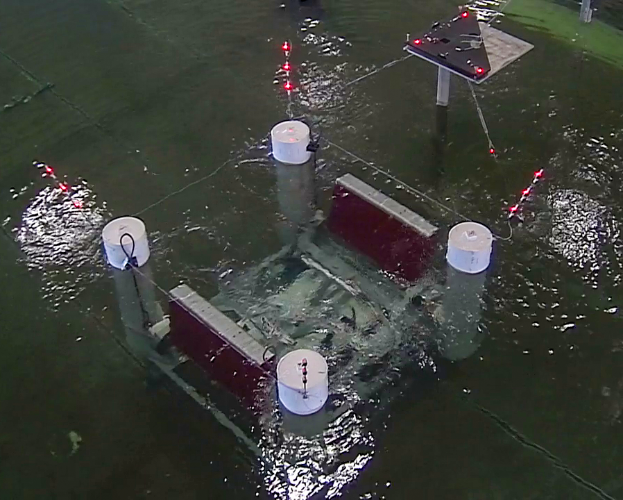

<!-- ## Mask Basin Workshop & FOSTWIN Digital Twin omit in toc -->

**Participate in our FOSTWIN control competition for a chance to travel to the MASK Basin Workshop in Bethesda, MD on [Sandia National Lab's](https://energy.sandia.gov/programs/renewable-energy/water-power/) dime!**  

<!-- Make a table for aligning images -->

| - | - |
|---|---|
|  |  |

If you're a student or post-grad interested in wave energy converters (WEC) and developing control software for WEC's, don't miss this opportunity to be a part of large-scale tank testing of the Sandia WaveBot!  

Through our [open source repository](https://github.com/PMEC-OSU/FOSTWIN), planned public workshops, and user managed web platform, we will provide all the resources needed for multiple levels of experience and dynamics modeling skill levels to have a chance at being one of the top ***N*** selected controllers!

##### Sandia WaveBot <!-- omit in toc -->

<iframe width="560" height="315" src="https://www.youtube.com/embed/c4npWk_-Pjk" title="YouTube video player" style="width:100%;" frameborder="0" allow="accelerometer; autoplay; clipboard-write; encrypted-media; gyroscope; picture-in-picture" allowfullscreen></iframe>

## Competition <!-- omit in toc -->

Develop a controller for a digital twin of the [FOSWEC](https://energy.sandia.gov/foswec-testing-helps-validate-open-source-modeling-code/) device.  The goal of this controller will be to generate the largest quantity of electrical power across a pre-defined simulation duration.  Top ***N*** electrical power producing controllers will be selected based off data gathered during the simulation and the developer will be awarded the opportunity to participate in, and have their travel expenses reimbursed for attending the [MASK Basin](https://www.defense.gov/Multimedia/Photos/igphoto/2001207018/#:~:text=The%20Navy's%20Indoor%20Ocean%20%2D%2D,Carderock%20Division%2C%20located%20in%20Maryland.) Workshop in **September 2023**.

| - | - |
|---|---|
| The controller for the competition will be built to control a System Identification digital twin model of the FOSWEC device, a real world tank-scale floating oscillating surge wave energy converter.  The twin for the competition was modeled from the data collected in a similar wave tank testing campaign done at [OSU O.H. Hinsdale Wave Research Laboratory](https://engineering.oregonstate.edu/facilities/wave-lab). |  |

In order to qualify for reimbursement to attend the workshop there's just a few steps you'll need to take:

1. [Enroll in the FOSTWIN control competition](#how-to-enroll)
2. [Get Familiar with the FOSWEC Digital Twin and the associated web interface](#getting-familiar) 
3. [Develop a custom controller as a [Simulink Real-Time](https://www.mathworks.com/products/simulink-real-time.html) model](#developing-a-custom-controller)
4. [Run and debug your controller locally then through the web interface to allow it to run on realtime [Speedgoat](https://www.speedgoat.com/) hardware](#running-models-and-controller)
5. [Collect & submit your results through the web interface](#collect-results-and-submit)

### Goals of Competition <!-- omit in toc -->

1. Connect motivated WEC developers with industry leaders and researchers
2. Build experience with developing real-time control software for WEC Devices
3. Extend on content from the 2019 PMEC workshop (video below of PMEC Workshop) and learn about FOSWEC devices
4. Acquire knowledge about WEC modeling in working with the [FOSTWIN](https://github.com/PMEC-OSU/FOSTWIN) open source repository
5. Learn from Sandia WEC experts and the NAVY about developing System Identification (SID) methods from large scale testing to improve WEC modeling
6. Deepen understanding of modeling techniques between the [WECSim](https://wec-sim.github.io/WEC-Sim/master/index.html) and [System Identification](https://github.com/PMEC-OSU/FOSTWIN#system-identification-model) digital twins available in the interface.
 
<iframe width="560" height="315" src="https://www.youtube.com/embed/OUxbaEC2K6Y" title="YouTube video player" frameborder="0" allow="accelerometer; autoplay; clipboard-write; encrypted-media; gyroscope; picture-in-picture" style="width:100%;" allowfullscreen></iframe>

### How to Enroll <!-- omit in toc -->

To participate in this competition, you must have a few pre-requisites:

1. Valid MATLAB License 
2. Simulink Real-Time Toolbox - to develop a controller (SPECIFICS NEEDED HERE)
3. Internet Connection - for using web interface
4. Others?

If those requirements are met, then all you'll need is to be granted access to the web interface.  Through a system that's currently in development, you will be provided a username and a link to create a password along with a few options of times where you can use the system.  You'll be prompted to select a few times to reserve as your turn on the system, then can log in during those periods and run your controller against our [SystemID] digital twin model.

### Getting Familiar <!-- omit in toc -->

To begin, start with the readme that is in the root of the [open source repository](https://github.com/PMEC-OSU/FOSTWIN).  There are text, pdf, and video tutorials to help you get familiar with the system.  Once you've gotten familiar with the modeling at a high level (understand the signals passed between twin and controller and differences between the digital twin model options) you're ready to step into real-time control through the web interface.  The web platform allows individuals without the appropriate toolboxes or realtime Speedgoat hardware to work with realtime control systems (however participants will need the appropriate toolboxes to develop their custom controller). 

### Developing a Custom Controller <!-- omit in toc -->

### Running Models and Controller <!-- omit in toc -->

### Collect Results and Submit <!-- omit in toc -->

