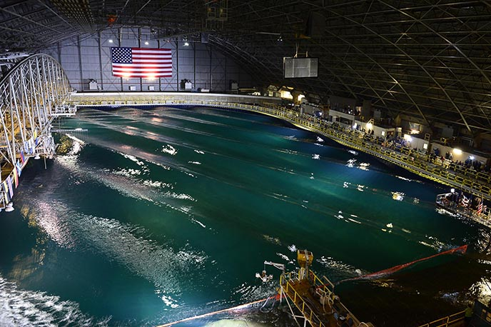

## Mask Basin Workshop & FOSTWIN Digital Twin <!-- omit in toc -->



**Participate in our FOSTWIN control competition for a chance to travel to the MASK Basin Workshop in Bethesda, MD on [Sandia National Lab's](https://energy.sandia.gov/programs/renewable-energy/water-power/) dime!**  

If you're a student or post-grad interested in wave energy converters (WEC) and developing control software for WEC's, don't miss this opportunity to be a part of large-scale tank testing of the Sandia WaveBot!  


##### Sandia WaveBot <!-- omit in toc -->

<iframe width="560" height="315" src="https://www.youtube.com/embed/c4npWk_-Pjk" title="YouTube video player" style="width:100%;" frameborder="0" allow="accelerometer; autoplay; clipboard-write; encrypted-media; gyroscope; picture-in-picture" allowfullscreen></iframe>

## Competition <!-- omit in toc -->

Develop a controller for a digital twin of the [FOSWEC](https://energy.sandia.gov/foswec-testing-helps-validate-open-source-modeling-code/) device.  The goal of this controller will be to generate the largest quantity of electrical power across a pre-defined simulation duration.  Top ***N*** power producing controllers will be selected based off data gathered during the simulation and the developer will be awarded the opportunity to participate in, and have their travel expenses reimbursed for attending the [MASK Basin](https://www.defense.gov/Multimedia/Photos/igphoto/2001207018/#:~:text=The%20Navy's%20Indoor%20Ocean%20%2D%2D,Carderock%20Division%2C%20located%20in%20Maryland.) Workshop in **September 2023**.


In order to qualify for reimbursement to attend the workshop there's just a few steps you'll need to take:
1. [Enroll in the FOSTWIN control competition](#how-to-enroll)
2. [Get Familiar with the FOSWEC Digital Twin and the associated web interface](#getting-familiar) 
3. [Develop a custom controller as a [Simulink Real-Time](https://www.mathworks.com/products/simulink-real-time.html) model](#developing-a-custom-controller)
4. [Run and debug your controller locally then through the web interface to allow it to run on realtime [Speedgoat](https://www.speedgoat.com/) hardware](#running-models-and-controller)
5. [Collect & submit your results through the web interface](#collect-results-and-submit)


<iframe width="560" height="315" src="https://www.youtube.com/embed/OUxbaEC2K6Y" title="YouTube video player" frameborder="0" allow="accelerometer; autoplay; clipboard-write; encrypted-media; gyroscope; picture-in-picture" style="width:100%;" allowfullscreen></iframe>

### Goals of Competition <!-- omit in toc -->

1. Connect motivated WEC developers with industry leaders and researchers
2. Build experience with developing real-time hardware control software for WEC Devices
3. Extend on content from the 2019 PMEC workshop (video below of PMEC Workshop)
4. Learn about WEC modeling in working with [FOSTWIN](https://github.com/PMEC-OSU/FOSTWIN) open source repository
5. Learn from Sandia WEC experts and the NAVY about developing System Identification (SID) methods from large scale testing to improve WEC modeling
 


### How to Enroll <!-- omit in toc -->

### Getting Familiar <!-- omit in toc -->

### Developing a Custom Controller <!-- omit in toc -->

### Running Models and Controller <!-- omit in toc -->

### Collect Results and Submit <!-- omit in toc -->


You can use the [editor on GitHub](https://github.com/evergreen-innovations/sandia-fostwin-test-github-page/edit/main/docs/index.md) to maintain and preview the content for your website in Markdown files.

Whenever you commit to this repository, GitHub Pages will run [Jekyll](https://jekyllrb.com/) to rebuild the pages in your site, from the content in your Markdown files.

### Markdown

Markdown is a lightweight and easy-to-use syntax for styling your writing. It includes conventions for

```markdown
Syntax highlighted code block

# Header 1
## Header 2
### Header 3

- Bulleted
- List

1. Numbered
2. List

**Bold** and _Italic_ and `Code` text

[Link](url) and 
```

For more details see [Basic writing and formatting syntax](https://docs.github.com/en/github/writing-on-github/getting-started-with-writing-and-formatting-on-github/basic-writing-and-formatting-syntax).

### Jekyll Themes

Your Pages site will use the layout and styles from the Jekyll theme you have selected in your [repository settings](https://github.com/evergreen-innovations/sandia-fostwin-test-github-page/settings/pages). The name of this theme is saved in the Jekyll `_config.yml` configuration file.

### Support or Contact

Having trouble with Pages? Check out our [documentation](https://docs.github.com/categories/github-pages-basics/) or [contact support](https://support.github.com/contact) and we’ll help you sort it out.
